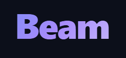

<p align="center">
  
</p>

<h3 align="center">Encrypted ephemeral sharing between any devices.</h3>

<p align="center">
  No install on the receiving end &nbsp;·&nbsp; No accounts &nbsp;·&nbsp; No persistence by default
</p>

<p align="center">
  <a href="LICENSE"></a>
  &nbsp;
  <a href="https://github.com/aziz66/beam/pkgs/container/beam"></a>
</p>

---

## Why Beam?

| | |
|---|---|
| **Zero install** | The receiver just opens a browser tab — no app, no extension |
| **Zero knowledge** | E2E encrypted; the server only ever sees encrypted blobs |
| **Zero accounts** | No sign-up, no login, no tracking |
| **Single binary** | One command to self-host — Go binary embeds everything |

---

## Quick Start

### Docker

```bash
docker run -p 8080:8080 ghcr.io/aziz66/beam
```

### Binary

Download the latest release from [GitHub Releases](https://github.com/aziz66/beam/releases), then:

```bash
./beam --port 8080
```

### From Source

```bash
git clone https://github.com/aziz66/beam.git
cd beam
go build -ldflags "-s -w" -o beam .
./beam
```

Open `http://localhost:8080` — you get a room with a QR code and shareable link. Open that link on any other device to start sharing instantly.

---

## How It Works

1. Visit the server — a room is created with a unique code like `coral-tiger-88`
2. An encryption key is generated in your browser and placed in the URL fragment (`#key`)
3. Share the link (QR code, copy button, etc.) — the `#key` part **never leaves the browser**
4. Drop files, paste text, share links — everything is encrypted before leaving your device
5. The server relays encrypted blobs. It cannot read your data.

```
https://your-server.com/r/coral-tiger-88#E2EKeyHere
                         └── sent to server  └── never sent to server
```

---

## Features

- **Text & clipboard** — paste text, links, code snippets; auto-detects content kind
- **File streaming** — drag-and-drop or attach files, streamed in 64 KB encrypted chunks with live progress
- **Feed filters** — filter the shared feed by type: Text, Links, Code, Media, Files
- **Link previews** — OG tag extraction for shared URLs
- **Tap to copy / download** — tap any text/code bubble to copy; tap any file to download
- **P2P upgrade** — WebRTC direct connection for 2-device rooms on the same network
- **Pinned rooms** — persistent rooms with optional passphrase protection (bcrypt)
- **PWA** — installable on mobile, share-target support on Android/iOS
- **CLI client** — `beam send`, `beam receive`, `beam new`
- **Desktop agent** — Tauri tray app for clipboard auto-sync
- **Dark/light theme** — follows system preference

---

## Configuration

All settings can be set via flags or `BEAM_*` environment variables.

| Flag | Env Var | Default | Description |
|------|---------|---------|-------------|
| `--port` | `BEAM_PORT` | `8080` | Server port |
| `--host` | `BEAM_HOST` | `0.0.0.0` | Bind address |
| `--max-room-size` | `BEAM_MAX_ROOM_SIZE` | `10` | Max devices per room |
| `--default-ttl` | `BEAM_DEFAULT_TTL` | `30m` | Default item TTL |
| `--max-file-buffer` | `BEAM_MAX_FILE_BUFFER` | `268435456` | Max file buffer (bytes) |
| `--enable-pinned-rooms` | `BEAM_ENABLE_PINNED_ROOMS` | `true` | Allow pinned rooms |
| `--data-dir` | `BEAM_DATA_DIR` | `./data` | Data directory for pinned rooms |
| `--tls-cert` | `BEAM_TLS_CERT` | | TLS certificate path |
| `--tls-key` | `BEAM_TLS_KEY` | | TLS key path |
| `--grace-period` | `BEAM_GRACE_PERIOD` | `5m` | Room grace period after last disconnect |
| `--max-rooms` | `BEAM_MAX_ROOMS` | `1000` | Max concurrent rooms |

---

## Self-Hosting

> **TLS is required for production.** The encryption key lives in the URL fragment — over plain HTTP it is visible in browser history and to network observers. Always use HTTPS.

### Direct TLS

```bash
./beam --tls-cert /path/to/cert.pem --tls-key /path/to/key.pem --port 443
```

### Behind Caddy (automatic HTTPS)

```
beam.example.com {
    reverse_proxy localhost:8080
}
```

### Behind Nginx

```nginx
server {
    listen 443 ssl;
    server_name beam.example.com;

    ssl_certificate     /etc/letsencrypt/live/beam.example.com/fullchain.pem;
    ssl_certificate_key /etc/letsencrypt/live/beam.example.com/privkey.pem;

    location / {
        proxy_pass http://127.0.0.1:8080;
        proxy_http_version 1.1;
        proxy_set_header Upgrade $http_upgrade;
        proxy_set_header Connection "upgrade";
        proxy_set_header Host $host;
        proxy_set_header X-Real-IP $remote_addr;
    }
}
```

### Docker Compose

```yaml
services:
  beam:
    image: ghcr.io/aziz66/beam:latest
    ports:
      - "8080:8080"
    volumes:
      - beam-data:/app/data
    environment:
      - BEAM_MAX_ROOMS=500
    restart: unless-stopped

volumes:
  beam-data:
```

---

## CLI

Build the CLI:

```bash
go build -o beam-cli ./cli/
```

Usage:

```bash
# Create a new room
beam-cli new --server https://beam.example.com

# Send a file
beam-cli send ./report.pdf --room coral-tiger-88 --key <base64key>

# Send text from stdin
echo "hello world" | beam-cli send --room coral-tiger-88 --key <base64key>

# Receive (watch room, download files)
beam-cli receive --room coral-tiger-88 --key <base64key>
```

---

## Desktop Agent

The desktop agent is a system tray app (Tauri/Rust) that stays connected to a room and automatically syncs your clipboard.

**Requirements:** Rust + Cargo + [Tauri prerequisites](https://tauri.app/start/prerequisites/)

```bash
cd agent
cargo tauri build
```

The built installer is in `agent/src-tauri/target/release/bundle/`.

---

## API

```bash
# Health check
curl http://localhost:8080/api/health

# Create a room
curl -X POST http://localhost:8080/api/rooms

# Create a pinned room with passphrase
curl -X POST http://localhost:8080/api/rooms \
  -H "Content-Type: application/json" \
  -d '{"pinned": true, "passphrase": "secret"}'

# Get room info
curl http://localhost:8080/api/rooms/coral-tiger-88

# Delete a pinned room (passphrase via header)
curl -X DELETE http://localhost:8080/api/rooms/coral-tiger-88 \
  -H "X-Passphrase: secret"

# Send an item
curl -X POST http://localhost:8080/api/rooms/coral-tiger-88/items \
  -H "Content-Type: application/json" \
  -d '{"kind": "text", "encrypted_data": "...", "nonce": "..."}'

# Get link preview
curl "http://localhost:8080/api/preview?url=https://example.com"
```

---

## Security

- **E2E encryption** — TweetNaCl secretbox (XSalsa20-Poly1305) with a fresh random 24-byte nonce per message
- **Key never leaves the browser** — lives in the URL fragment (`#key`), which browsers never send to servers
- **Blind relay** — the server only sees encrypted blobs, room codes, and device IDs
- **Passphrase hashing** — pinned room passphrases stored as bcrypt (cost 12)
- **SSRF protection** — link preview endpoint blocks private IP ranges and redirect chains to private IPs
- **Subresource Integrity** — SHA-384 hashes on all JS assets; browser refuses to execute tampered scripts
- **Security headers** — CSP, X-Frame-Options, X-Content-Type-Options, Referrer-Policy on all responses
- **WebSocket rate limiting** — token bucket (30 msg/s, burst 60) per connection
- **CORS enforcement** — WebSocket connections restricted to same-origin host
- **Non-root container** — Docker image runs as a dedicated `beam` user

---

## Architecture

```
beam/
├── main.go                  # Entry point, HTTP routing, go:embed, security headers
├── internal/
│   ├── config/              # Configuration (flags + BEAM_* env vars)
│   ├── hub/                 # WebSocket upgrade, read pump, rate limiting
│   ├── room/                # Room lifecycle, item storage, BadgerDB store
│   ├── relay/               # Message broadcast / targeted forwarding
│   ├── signaling/           # WebRTC SDP/ICE relay (stateless passthrough)
│   ├── api/                 # REST API handlers
│   ├── preview/             # Link OG-tag fetcher with LRU cache + SSRF guard
│   ├── protocol/            # Wire protocol message types (JSON envelopes)
│   └── namegen/             # Room code generator (adjective-noun-NN)
├── web/                     # Frontend (embedded via go:embed)
│   ├── js/                  # Vanilla ES modules — no framework, no bundler
│   ├── css/                 # BEM-style CSS, dark/light via prefers-color-scheme
│   └── lib/                 # Vendored: TweetNaCl.js, QRCode.js
├── cli/                     # CLI client
└── agent/                   # Desktop tray agent (Tauri/Rust)
```

---

## Contributing

Pull requests are welcome. For significant changes, open an issue first to discuss what you'd like to change.

- Follow the existing code style (see comments in source)
- Keep commits conventional: `feat:`, `fix:`, `chore:`, `docs:`, `refactor:`
- Run `go test ./... -race` before submitting

---

## License

MIT
